# Workspace Projects Overview & Architectural Comparison

This document provides a single-pane-of-glass overview and side-by-side comparison of all software applications identified in this workspace.

---

## 1. Projects Directory & Documentation Index

| Project Folder | Application Identity | Platform & Nature | Detailed Analysis Document |
|---|---|---|---|
| [`video_player-main/video_player-main`](file:///c:/Users/proju/Downloads/my%20projects/video_player-main/video_player-main) | **WatchTogether Local Video Player** | Native Android Client (Kotlin / Compose) | [APP_ANALYSIS.md](file:///c:/Users/proju/Downloads/my%20projects/video_player-main/video_player-main/APP_ANALYSIS.md) |
| [`watch_together_android_app-main/watch_together_android_app-main`](file:///c:/Users/proju/Downloads/my%20projects/watch_together_android_app-main/watch_together_android_app-main) | **WatchTogether Hybrid Suite** (Integrated Player + P2P WebRTC Engine) | Fullstack (Android + Node.js Backend) | [APP_ANALYSIS.md](file:///c:/Users/proju/Downloads/my%20projects/watch_together_android_app-main/watch_together_android_app-main/APP_ANALYSIS.md) |
| [`android app`](file:///c:/Users/proju/Downloads/my%20projects/android%20app) & [`ourtime-main`](file:///c:/Users/proju/Downloads/my%20projects/ourtime-main/ourtime-main) | **WatchTogether / OurTime P2P Streaming App** | Fullstack (Android + TypeScript Server) | [APP_ANALYSIS.md](file:///c:/Users/proju/Downloads/my%20projects/android%20app/APP_ANALYSIS.md) |
| [`sharepoint_project_v01-main/sharepoint_project_v01-main`](file:///c:/Users/proju/Downloads/my%20projects/sharepoint_project_v01-main/sharepoint_project_v01-main) | **SharePoint Management Platform v01** | Web SPA (React 19 + Vite) | [APP_ANALYSIS.md](file:///c:/Users/proju/Downloads/my%20projects/sharepoint_project_v01-main/sharepoint_project_v01-main/APP_ANALYSIS.md) |
| [`sharepoint_manager_final_v4-main/sharepoint_manager_final_v4-main`](file:///c:/Users/proju/Downloads/my%20projects/sharepoint_manager_final_v4-main/sharepoint_manager_final_v4-main) | **Enterprise SharePoint Management Platform v4** | Web SPA (React 19 + Vite + Gemini) | [APP_ANALYSIS.md](file:///c:/Users/proju/Downloads/my%20projects/sharepoint_manager_final_v4-main/sharepoint_manager_final_v4-main/APP_ANALYSIS.md) |
| [`apex-fit-public-launch-v1.0.0/apex-fit-main`](file:///c:/Users/proju/Downloads/my%20projects/apex-fit-public-launch-v1.0.0/apex-fit-main) | **Apex Fit — AI Fitness & Diet Tracker** | Fullstack Mobile PWA (React 19 + Express + Firebase + Gemini) | [APP_ANALYSIS.md](file:///c:/Users/proju/Downloads/my%20projects/apex-fit-public-launch-v1.0.0/apex-fit-main/APP_ANALYSIS.md) |

---

## 2. High-Level Architectural Comparison

```mermaid
graph TD
    subgraph MobileDomain ["Native Android Media Ecosystem"]
        A1["1. Local Video Player<br/>(Media3 ExoPlayer + LibVLC)"]
        A2["2. WatchTogether Hybrid Suite<br/>(Preserved Video Player + WebRTC P2P + Node Server)"]
        A3["3. WatchTogether / OurTime<br/>(Tri-channel WebRTC DataChannels + In-Watch Video Call)"]
    end

    subgraph WebDomain ["SharePoint Enterprise Web Ecosystem"]
        W1["4. SharePoint Management v01<br/>(Graph Client + MSAL + Adaptive Tables)"]
        W2["5. SharePoint Enterprise v4<br/>(Config-driven Workspaces + BatchQueue + GenAI)"]
    end

    subgraph FitnessAIDomain ["Health & Multimodal AI Ecosystem"]
        F1["6. Apex Fit Tracker<br/>(PWA + Firebase Admin + Gemini Multimodal Vision + Firestore)"]
    end

    A1 -.->|"Engine integrated into"| A2
    A2 <-->|"Evolutionary alternative"| A3
    W1 -.->|"Architecture evolved into"| W2
```

---

## 3. Side-by-Side Matrix

| Dimension | Video Player | WatchTogether Hybrid | WatchTogether / OurTime | SharePoint v01 | SharePoint v4 | Apex Fit Tracker |
|---|---|---|---|---|---|---|
| **Primary Goal** | High-performance offline video playback. | Synchronize local video playback peer-to-peer. | Synchronized movie watching with live video calling. | Fast web interface for SharePoint list/item management. | Configuration-driven enterprise workplace & dashboard. | AI-assisted mobile fitness, nutrition & workout tracker. |
| **Client Tech Stack** | Kotlin, Jetpack Compose, Material 3, Room ORM. | Kotlin, Jetpack Compose, Stream WebRTC, Media3/LibVLC. | Kotlin, Jetpack Compose, Media3 ExoPlayer, Stream WebRTC. | React 19, TypeScript, Vite, Tailwind CSS, TanStack Table & Query. | React 19, TypeScript, Vite, Tailwind CSS v4, React Hook Form, Zod. | React 19, TypeScript, Vite, Tailwind CSS v4, Motion, Firebase SDK. |
| **Backend / Services** | None (100% offline local client). | Node.js, `ws` (WebSocket), in-memory room manager. | Node.js, TypeScript, Express, `ws`, 6-char room tokens. | Direct Microsoft Graph API via MSAL Browser. | Microsoft Graph API + Google GenAI + MSAL Browser. | Node.js/Express, Firebase Admin SDK, Google Gemini (`@google/genai`). |
| **Transport / Protocols** | Android ContentResolver, MediaStore, SAF. | WebRTC DataChannel, embedded HTTP 206 server, WebSocket. | 3 WebRTC DataChannels + WebRTC MediaStream. | HTTPS REST (Microsoft Graph v1.0). | HTTPS REST with Graph `$batch` bundling via `batchQueue.ts`. | HTTPS REST with Firebase Bearer Auth & Cloud Firestore sync. |
| **State Management** | StateFlow, SharedFlow, MVVM. | StateFlow, MVVM, `PlaybackSyncManager`. | StateFlow, MVVM, `SyncManager`, `ChunkCacheManager`. | Zustand stores + TanStack React Query. | Zustand (`useAppStore`) + TanStack Query + Context RBAC. | React State + Real-time Firestore `onSnapshot`. |
| **Key Limitation** | No network/P2P capabilities; higher APK size. | Strictly 2 participants; upload bandwidth determines quality. | High memory/disk cache consumption; 1:1 limit. | Graph API list threshold (5,000 items); unbatched mutations. | Client-side audit trail storage; introspection round-trips. | 2D food portion ambiguity; offline limitations for vision AI. |

---

## 4. Recommendations & Next Steps

1. **Mobile Media Unification**: Unify `video_player-main` with the WebRTC chunked transfer and local HTTP streaming engines from `watch_together_android_app-main` and `android app`.
2. **SharePoint Platform Convergence**: Continue expanding `sharepoint_manager_final_v4-main` as the primary enterprise control plane with its resilient batching and dynamic forms.
3. **Fitness AI Scaling**: For `apex-fit`, implement persistent vector embeddings for long-term personalized coaching and optional local ML food classification for offline support.
