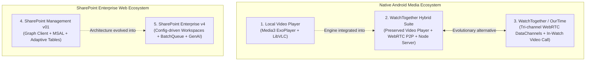

# Workspace Projects Overview & Architectural Comparison

This document provides a single-pane-of-glass overview and side-by-side comparison of all 5 software applications identified in this workspace.

---

## 1. Projects Directory & Documentation Index

| Project Folder | Application Identity | Platform & Nature | Detailed Analysis Document |
|---|---|---|---|
| [`video_player-main/video_player-main`](file:///c:/Users/proju/Downloads/my%20projects/video_player-main/video_player-main) | **WatchTogether Local Video Player** | Native Android Client (Kotlin / Compose) | [APP_ANALYSIS.md](file:///c:/Users/proju/Downloads/my%20projects/video_player-main/video_player-main/APP_ANALYSIS.md) |
| [`watch_together_android_app-main/watch_together_android_app-main`](file:///c:/Users/proju/Downloads/my%20projects/watch_together_android_app-main/watch_together_android_app-main) | **WatchTogether Hybrid Suite** (Integrated Player + P2P WebRTC Engine) | Fullstack (Android + Node.js Backend) | [APP_ANALYSIS.md](file:///c:/Users/proju/Downloads/my%20projects/watch_together_android_app-main/watch_together_android_app-main/APP_ANALYSIS.md) |
| [`android app`](file:///c:/Users/proju/Downloads/my%20projects/android%20app) & [`ourtime-main`](file:///c:/Users/proju/Downloads/my%20projects/ourtime-main/ourtime-main) | **WatchTogether / OurTime P2P Streaming App** | Fullstack (Android + TypeScript Server) | [APP_ANALYSIS.md](file:///c:/Users/proju/Downloads/my%20projects/android%20app/APP_ANALYSIS.md) |
| [`sharepoint_project_v01-main/sharepoint_project_v01-main`](file:///c:/Users/proju/Downloads/my%20projects/sharepoint_project_v01-main/sharepoint_project_v01-main) | **SharePoint Management Platform v01** | Web SPA (React 19 + Vite) | [APP_ANALYSIS.md](file:///c:/Users/proju/Downloads/my%20projects/sharepoint_project_v01-main/sharepoint_project_v01-main/APP_ANALYSIS.md) |
| [`sharepoint_manager_final_v4-main/sharepoint_manager_final_v4-main`](file:///c:/Users/proju/Downloads/my%20projects/sharepoint_manager_final_v4-main/sharepoint_manager_final_v4-main) | **Enterprise SharePoint Management Platform v4** | Web SPA (React 19 + Vite + Gemini) | [APP_ANALYSIS.md](file:///c:/Users/proju/Downloads/my%20projects/sharepoint_manager_final_v4-main/sharepoint_manager_final_v4-main/APP_ANALYSIS.md) |

---

## 2. High-Level Architectural Comparison

---

## 3. Side-by-Side Matrix

| Dimension | Video Player (`video_player-main`) | WatchTogether Hybrid (`watch_together_android_app`) | WatchTogether / OurTime (`android app`) | SharePoint v01 (`sharepoint_project_v01`) | SharePoint v4 (`sharepoint_manager_final_v4`) |
|---|---|---|---|---|---|
| **Primary Goal** | High-performance offline video playback with gesture controls. | Synchronize local video playback peer-to-peer between two friends. | Synchronized movie watching with live video calling and text chat. | Fast web interface for SharePoint list, item, and schema management. | Configuration-driven enterprise workplace and dashboard platform. |
| **Client Tech Stack** | Kotlin, Jetpack Compose, Material 3, Room ORM, DataStore. | Kotlin, Jetpack Compose, Material 3, Stream WebRTC, Media3/LibVLC. | Kotlin, Jetpack Compose, Material 3, Media3 ExoPlayer, Stream WebRTC. | React 19, TypeScript, Vite, Tailwind CSS, TanStack Table & Query. | React 19, TypeScript, Vite, Tailwind CSS v4, React Hook Form, Zod, Motion. |
| **Backend / Services** | None (100% offline local client). | Node.js, `ws` (WebSocket), in-memory room manager, REST API. | Node.js, TypeScript, Express, `ws`, ephemeral 6-char room tokens. | Direct Microsoft Graph API via MSAL Browser authentication. | Microsoft Graph API + Google GenAI (`@google/genai`) + MSAL Browser. |
| **Transport / Protocols** | Android ContentResolver, MediaStore, SAF. | WebRTC DataChannel, embedded HTTP 206 local server, WebSocket. | 3 WebRTC DataChannels (`control`, `file`, `chat`) + WebRTC MediaStream. | HTTPS REST (Microsoft Graph v1.0 / beta). | HTTPS REST with Graph `$batch` bundling via `batchQueue.ts`. |
| **State Management** | StateFlow, SharedFlow, MVVM. | StateFlow, MVVM, `PlaybackSyncManager`. | StateFlow, MVVM, `SyncManager`, `ChunkCacheManager`. | Zustand stores + TanStack React Query. | Zustand (`useAppStore`) + TanStack Query + Context RBAC. |
| **Key Limitation** | No network/P2P capabilities; higher APK size due to LibVLC. | Strictly 2 participants; upload bandwidth determines stream quality. | High memory and disk cache consumption; single-session P2P mesh limits. | Graph API list threshold (5,000 items); unbatched mutations. | In-browser client audit trail; schema introspection round-trip overhead. |

---

## 4. Recommendations & Next Steps

1. **Mobile Media Unification**:
   - `video_player-main` serves as the robust playback core, while `watch_together_android_app-main` and `android app` provide complementary P2P streaming models (LAN HTTP 206 vs. WebRTC chunked DataChannels). Unifying them into a single project with selectable transport modes (Local LAN vs. WebRTC P2P) would produce a definitive Android collaborative media app.
2. **SharePoint Platform Convergence**:
   - `sharepoint_manager_final_v4-main` represents the superior enterprise architecture with its `DataProvider` abstraction, `batchQueue.ts` resilience, and configuration-driven workspace system. New development should build on v4, incorporating the custom column/view editor components from v01.
