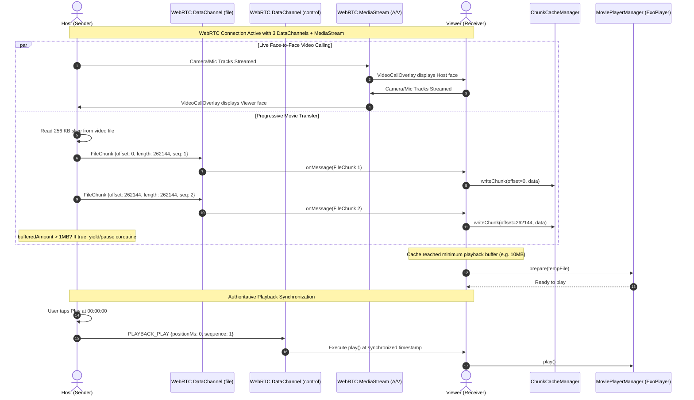

# Technical Analysis: WatchTogether / OurTime P2P Streaming App (`android app` & `ourtime-main`)

## 1. Executive Summary & Goal

### Purpose & Objective
`android app` (also packaged in `ourtime-main`) is an all-in-one native Android peer-to-peer watch party platform paired with a Node.js TypeScript signaling backend. It empowers two users to watch locally stored video files in exact synchronization while simultaneously engaging in real-time text chat and WebRTC audio/video calling.

### Core Problem Solved
Traditional watch-party solutions (Teleparty, Scener) require users to subscribe to third-party SVOD streaming services (Netflix, Prime, Disney+) or upload pirated/personal media files to remote web servers. This project eliminates both hurdles:
- Video bytes are transferred directly between devices using chunked WebRTC DataChannels with backpressure throttling.
- The viewer begins playing the media stream before the full file finishes transferring via a custom chunk-caching layer.
- An integrated floating video call overlay and sliding chat drawer provide intimacy without switching out of full-screen playback.

---

## 2. Architecture & Design Patterns

The application follows **Clean Architecture** on Android (Core, Data, Domain, Presentation) combined with a modular **TypeScript Node.js Signaling Microservice**.

```
┌──────────────────────────────────────────────────────────────────────────────────────────────────┐
│                             WATCHTOGETHER / OURTIME ARCHITECTURE                                 │
│                                DETAILED ARCHITECTURAL BLUEPRINT                                  │
└──────────────────────────────────────────────────────────────────────────────────────────────────┘

 ┌────────────────────────────────────────────────────────────────────────────────────────────────┐
 │                                   NATIVE ANDROID CLIENT (KOTLIN)                               │
 │                                                                                                │
 │   ┌────────────────────────────────────────────────────────────────────────┐                   │
 │   │                   Presentation Layer (Jetpack Compose)                 │                   │
 │   │  • HomeScreen / CreateRoomScreen / JoinRoomScreen / WaitingRoomScreen  │                   │
 │   │  • WatchRoomScreen:                                                    │                   │
 │   │    ┌───────────────────────────┐  ┌──────────────────────────────────┐ │                   │
 │   │    │     VideoPlayerView       │  │          ChatPanel               │ │                   │
 │   │    │  (ExoPlayer Compose View) │  │  (Slide-out Drawer, Instant P2P) │ │                   │
 │   │    └─────────────┬─────────────┘  └────────────────┬─────────────────┘ │                   │
 │   │                  │                                 │                   │                   │
 │   │                  ▼                                 ▼                   │                   │
 │   │    ┌─────────────────────────────────────────────────────────────────┐ │                   │
 │   │    │                      VideoCallOverlay                           │ │                   │
 │   │    │  • Draggable Floating PiP • Front-Camera Preview • Remote Track │ │                   │
 │   │    └─────────────────────────────────────────────────────────────────┘ │                   │
 │   └───────────────────────────────────┬────────────────────────────────────┘                   │
 │                                       │ StateFlow & UseCases                                   │
 │                                       ▼                                                        │
 │   ┌────────────────────────────────────────────────────────────────────────┐                   │
 │   │                      WatchTogetherRepository                           │                   │
 │   │  • Coordinates connection state, media caching, and participant status │                   │
 │   └───────────────────────────────────┬────────────────────────────────────┘                   │
 │                                       │                                                        │
 │         ┌─────────────────────────────┼────────────────────────────┐                           │
 │         ▼                             ▼                            ▼                           │
 │  ┌──────────────┐           ┌────────────────────┐      ┌────────────────────┐                 │
 │  │ SyncManager  │           │ FileTransferManager│      │ SignalingClient    │                 │
 │  │ • Monotonic  │           │ • 256 KB Chunks    │      │ • OkHttp WebSocket │                 │
 │  │   Seq Track  │           │ • Backpressure     │      │ • Reconnect Logic  │                 │
 │  │ • Jitter     │           │   Control (1MB cap)│      │ • Heartbeat PING   │                 │
 │  │   Filter     │           └─────────┬──────────┘      └─────────┬──────────┘                 │
 │  └──────┬───────┘                     │                           │                            │
 │         │                             ▼                           │                            │
 │         │                   ┌────────────────────┐                │                            │
 │         │                   │ ChunkCacheManager  │                │                            │
 │         │                   │ • RandomAccessFile │                │                            │
 │         │                   │ • Sparse temp file │                │                            │
 │         │                   │ • Offset tracking  │                │                            │
 │         │                   └─────────┬──────────┘                │                            │
 │         │                             │                           │                            │
 │         │                             ▼                           │                            │
 │         │                   ┌────────────────────┐                │                            │
 │         │                   │ MoviePlayerManager │                │                            │
 │         │                   │ • Media3 ExoPlayer │                │                            │
 │         │                   │ • ChunkDataSource  │                │                            │
 │         │                   └────────────────────┘                │                            │
 │         │                                                         │                            │
 │         ▼                                                         │                            │
 │  ┌─────────────────────────────────────────────────────────────┐  │                            │
 │  │              WebRtcManager (PeerConnection)                 │  │                            │
 │  │  ┌───────────────────────────────────────────────────────┐  │  │                            │
 │  │  │ 1. `control` DataChannel: Low-latency sync payloads   │  │  │                            │
 │  │  │ 2. `file` DataChannel: Ordered 256 KB binary chunks   │  │  │                            │
 │  │  │ 3. `chat` DataChannel: Peer-to-peer text messages     │  │  │                            │
 │  │  │ 4. MediaStream: Audio & Video Front-Camera Tracks     │  │  │                            │
 │  │  └───────────────────────────────────────────────────────┘  │  │                            │
 │  └──────────────────────────────┬──────────────────────────────┘  │                            │
 └─────────────────────────────────┼─────────────────────────────────┼────────────────────────────┘
                                   │                                 │
                   WebRTC P2P Data │ & MediaStream                   │ JSON Signaling
                                   │                                 ▼
 ┌─────────────────────────────────┼───────────────────────────────┬──────────────────────────────┐
 │                                 │                               │ SIGNALING MICROSERVICE       │
 │                                 │                               │ (NODE.JS + TYPESCRIPT)       │
 │                                 │                               │                              │
 │                                 │  ┌─────────────────────────┐  │ • Express Server (:8080)     │
 │                                 │  │  SignalingManager       │  │ • WebSocket Server (/ws)     │
 │                                 │  │  • Routes SDP & ICE     │  │ • RoomManager                │
 │                                 │  │  • Broadcasts Room Evts │  │   - 6-Char Code Allocation   │
 │                                 │  └────────────┬────────────┘  │   - 2-Peer Room Enforcement  │
 │                                 │               │               │   - Session TTL Reaper       │
 │                                 │               ▼               │                              │
 └─────────────────────────────────┼───────────────────────────────┴──────────────────────────────┘
                                   │
                                   ▼
 ┌────────────────────────────────────────────────────────────────────────────────────────────────┐
 │                                   REMOTE PEER (ANDROID CLIENT)                                 │
 │                                                                                                │
 │  ┌──────────────────────────────────────────────────────────────────────────────────────────┐  │
 │  │ WebRtcManager:                                                                           │  │
 │  │ • Receives 256 KB Chunks -> ChunkCacheManager -> Plays via MoviePlayerManager            │  │
 │  │ • Receives `control` updates -> SyncManager adjusts ExoPlayer timeline                   │  │
 │  │ • Receives MediaStream video tracks -> Renders in VideoCallOverlay                       │  │
 │  └──────────────────────────────────────────────────────────────────────────────────────────┘  │
 └────────────────────────────────────────────────────────────────────────────────────────────────┘
```

### Tri-Channel Chunking & Video Call Sequence



### Tri-Channel WebRTC Design
The app opens three specialized WebRTC DataChannels over a single PeerConnection:
1. `control` channel: Low-latency, reliable channel for play/pause/seek synchronization events, sequence IDs, and buffer status.
2. `file` channel: Ordered, reliable high-throughput channel for transferring binary 256KB movie chunks.
3. `chat` channel: Unordered or ordered real-time text chat messages.
4. `MediaStream` (Audio/Video): Separate WebRTC media tracks captured from the front-facing camera and microphone for the picture-in-picture video call.

---

## 3. Working & Execution Lifecycle

### 3.1 Session Handshake & Connection
1. **Room Creation**: Host calls `POST /api/rooms`. The TypeScript server generates a 6-character room token and stores it in `RoomManager`.
2. **WebSocket Association**: Both Host and Viewer connect to `ws://<host>:8080/ws?roomCode=<CODE>&peerId=<ID>&role=<HOST|VIEWER>`.
3. **WebRTC Signaling**: The server routes SDP Offer, SDP Answer, and ICE candidates between the two endpoints.
4. **DataChannel Initialization**: The Host initiates the `control`, `file`, and `chat` DataChannels. Once open, camera and microphone media tracks are attached for the peer video call.

### 3.2 File Chunk Streaming & Progressive Playback
1. **File Partitioning**: Host selects a video file via Android ContentResolver. `FileTransferManager` reads the file in 256 KB increments.
2. **Backpressure Regulation**: To prevent overflowing the WebRTC transmission buffer, `FileTransferManager` monitors `dataChannel.bufferedAmount`. If the buffer exceeds 1 MB, transmission yields until the buffer drains.
3. **Progressive Caching**:
   - The Viewer receives chunk frames (`offset`, `data`, `sequence`).
   - `ChunkCacheManager` writes incoming byte slices into a sparse temporary file (`RandomAccessFile`) in `context.cacheDir`.
4. **Playback Initiation**: Once sufficient initial seconds of video data are cached, `MoviePlayerManager` points `ExoPlayer` to the local cache file and initiates playback.

### 3.3 Synchronized Control & Floating Overlay
- When the Host pauses or seeks, `SyncManager` dispatches a payload over the `control` DataChannel with current `positionMs` and an incrementing `sequence`.
- The Viewer matches the Host's position with adaptive thresholding.
- The `VideoCallOverlay` displays the remote participant's live camera feed inside a draggable, floating Jetpack Compose card with mute/camera toggle controls.

---

## 4. Tech Stack & Dependencies

| Component | Technology | Version / Reference |
|---|---|---|
| **Android UI** | Jetpack Compose + Material 3 | `compose-bom:2024.05.00`, Material Icons Extended |
| **Android Architecture** | AndroidX Lifecycle & Coroutines | `lifecycle-runtime-ktx:2.7.0`, `kotlinx-coroutines:1.8.0` |
| **Video Engine** | AndroidX Media3 (ExoPlayer) | `androidx.media3:media3-exoplayer:1.3.1`, `media3-ui` |
| **WebRTC SDK** | Stream WebRTC Android | `io.getstream:stream-webrtc-android:1.1.1` |
| **Signaling Client** | OkHttp & Gson | `okhttp:4.12.0`, `gson:2.10.1` |
| **Signaling Server** | Node.js + TypeScript | `typescript:5.4.5`, `ts-node:10.9.2`, Node 20+ |
| **Server Frameworks**| Express & `ws` | `express:4.19.2`, `ws:8.17.0`, `cors:2.8.5`, `dotenv:16.4.5` |
| **NAT Traversal** | Google STUN & Coturn | Standard STUN/TURN RFC 5389 / 5766 |

---

## 5. Goals & Target Audience

- **Target Audience**: Mobile-first users who want a rich, synchronized video and video-chat experience on Android without requiring accounts, logins, or paid subscription services.
- **Goal**: Provide an end-to-end peer-to-peer ecosystem where video streaming, live face-to-face video calling, and text messaging happen within a single native Android interface.

---

## 6. Limitations & Technical Debt

1. **Storage Cache Exhaustion**: Storing the incoming video on the viewer's device requires available internal disk space equal to the total movie size. If a phone has < 2GB free storage, downloading a full-length 1080p movie will fail.
2. **Battery & Thermal Throttling**: Running hardware video decoding, camera encoding (WebRTC video track), and 256KB chunk encryption/decryption simultaneously puts heavy strain on the device's CPU and GPU, causing battery drain and potential thermal throttling on budget devices.
3. **Strict 1-to-1 Limitation**: The architecture cannot support 3 or more participants due to the exponential bandwidth required for full-mesh video calling and chunk replication.
4. **No Resumable File Transfers on Network Interruption**: If the WebRTC connection drops during chunk transmission, the current implementation lacks an automated byte-range resume mechanism and may need to re-verify or re-send chunks.

---

## 7. Version Control & Git Strategy (`.gitignore` Architecture)

The project includes Git version control configuration tailored for dual Android (Gradle/Kotlin) and Node.js (TypeScript) monorepo structures.

### 7.1 Git Repository Topography
```text
ourtime-main/ (or android app/)
├── .git/                      # Local Git revision store and object database
├── .gitignore                 # Unified multi-ecosystem exclusion manifest
├── app/                       # Android application module
└── server/                    # Node.js TypeScript signaling microservice
```

### 7.2 `.gitignore` Rule Classification

```gitignore
# ─────────────────────────────────────────────────────────────
# 1. ANDROID & GRADLE BUILD ARTIFACTS
# ─────────────────────────────────────────────────────────────
.gradle/                       # Gradle daemon runtime caches and task graphs
/build/                        # Root project build outputs
/app/build/                    # Compiled Android APKs, intermediate dex, resources
*.apk                          # Android package installers
*.aab                          # Android App Bundles
*.dex                          # Dalvik Executable binaries
*.class                        # Compiled Java/Kotlin bytecode
.externalNativeBuild           # CMake/NDK build outputs
.cxx                           # C++ native compilation scratch files
/captures                      # Android Studio performance profiler traces

# ─────────────────────────────────────────────────────────────
# 2. LOCAL ENVIRONMENT & SECRETS
# ─────────────────────────────────────────────────────────────
local.properties               # Android SDK path on developer machine
/local.properties              # Explicit root local properties
*.jks                          # Production upload and release signing keystores
*.keystore                     # Debug and release keystores
server/.env                    # Signaling backend secrets, TURN credentials
.env                           # Root environment secrets

# ─────────────────────────────────────────────────────────────
# 3. IDE & EDITOR METADATA
# ─────────────────────────────────────────────────────────────
.idea/                         # Android Studio / IntelliJ IDEA project metadata
*.iml                          # Legacy IDEA module descriptors
.vscode/                       # VS Code workspace state and launch configs
.DS_Store                      # macOS Finder desktop metadata
Thumbs.db                      # Windows Explorer thumbnail cache
*~                             # Editor backup swap files
*.swp                          # Vim swap buffers

# ─────────────────────────────────────────────────────────────
# 4. NODE.JS SIGNALING SERVER
# ─────────────────────────────────────────────────────────────
server/node_modules/           # Node.js npm dependency tree
server/dist/                   # Compiled TypeScript JavaScript bundle (tsc output)
npm-debug.log*                 # NPM error dumps
```

### 7.3 Recommended Git Workflow
- **Branching Model**: Maintain `main` for release-ready builds. Use `feature/p2p-streaming`, `feature/video-call`, and `fix/sync-drift` branches for isolated development.
- **Pre-Commit Hygiene**: Ensure Gradle builds (`./gradlew assembleDebug`) and TypeScript compilation (`npm run build` inside `server/`) succeed before committing.
- **Clean Clones**: New contributors simply clone the repo, specify their local Android SDK in `local.properties` (auto-generated by Android Studio), and run `npm install` in `server/`.

