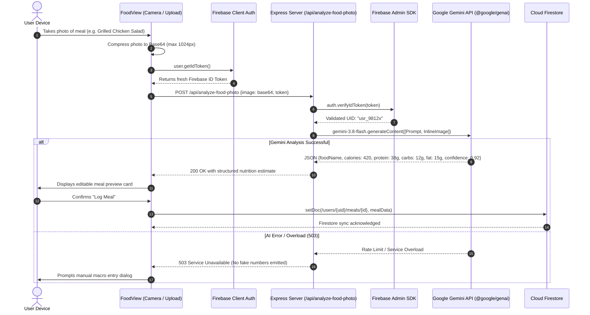

# Technical Analysis: Apex Fit — AI Fitness & Diet Tracker (`apex-fit-main`)

## 1. Executive Summary & Goal

### Purpose & Objective
`apex-fit-main` is a mobile-first Progressive Web Application (PWA) and full-stack cloud system designed for holistic health, fitness, and nutrition tracking. It augments manual logging with multimodal Google Gemini AI, allowing users to photograph meals, dictate voice food logs, record strength and cardio workouts, and interact with a contextual AI fitness coach.

### Core Problem Solved
Traditional fitness and nutrition apps (e.g., MyFitnessPal) suffer from severe data-entry friction: searching massive unverified databases, measuring portions manually, and navigating cluttered interfaces. Apex Fit solves this by:
- Offering instant camera-based food recognition and caloric/macronutrient estimation via Google Gemini multimodal vision.
- Providing natural language voice and text meal transcription.
- Enforcing zero-trust security where all AI calls are validated on a dedicated Node/Express proxy against Firebase Admin ID tokens.
- Structuring Firestore data with strict per-user boundary isolation (`/users/{uid}/...`).

---

## 2. Architecture & Design Patterns

The application implements a **Client-Server PWA Architecture with Firebase BaaS and Serverless AI Proxy Layer**.

```
┌──────────────────────────────────────────────────────────────────────────────────────────────────┐
│                                APEX FIT — SYSTEM ARCHITECTURAL BLUEPRINT                         │
└──────────────────────────────────────────────────────────────────────────────────────────────────┘

 ┌────────────────────────────────────────────────────────────────────────────────────────────────┐
 │                                   CLIENT PWA LAYER (REACT 19 + VITE)                           │
 │                                                                                                │
 │   ┌────────────────────────────────────────────────────────────────────────────────────────┐   │
 │   │                   Mobile-First PWA Shell (Navbar & DateNavigator)                      │   │
 │   │  • Service Worker Cache: Instant offline loading, stale-while-revalidate assets        │   │
 │   │  • AuthScreen: Firebase Client Authentication (Google OAuth & Guest Session)           │   │
 │   └───────────────────────────────────────────┬────────────────────────────────────────────┘   │
 │                                               │ Active View State                              │
 │                                               ▼                                                │
 │   ┌────────────────────────────────────────────────────────────────────────────────────────┐   │
 │   │                                Primary Feature Views                                   │   │
 │   │  ┌──────────────────────┐  ┌──────────────────────┐  ┌───────────────────────────────┐ │   │
 │   │  │     TodayView.tsx    │  │     FoodView.tsx     │  │       WorkoutView.tsx         │ │   │
 │   │  │ • Daily Calorie Bar  │  │ • Camera Photo Log   │  │ • Exercise Library & Sets     │ │   │
 │   │  │ • Macro Split Rings  │  │ • Voice Dictation    │  │ • Reps, Weight, Volume (kg)   │ │   │
 │   │  │ • Activity Summary   │  │ • Meal Timeline      │  │ • Cardio Duration & Distance  │ │   │
 │   │  └──────────────────────┘  └──────────┬───────────┘  └───────────────────────────────┘ │   │
 │   │  ┌──────────────────────┐             │              ┌───────────────────────────────┐ │   │
 │   │  │   ProgressView.tsx   │             │              │       AiCoachView.tsx         │ │   │
 │   │  │ • Weight Trend Chart │             │              │ • Conversational Advice       │ │   │
 │   │  │ • Body Measurement   │             │              │ • Weekly Nutrition Context    │ │   │
 │   │  │ • Streak Counter     │             │              │ • Recovery & Routine Guidance │ │   │
 │   │  └──────────────────────┘             │              └───────────────┬───────────────┘ │   │
 │   └───────────────────────────────────────┼──────────────────────────────┼─────────────────┘   │
 │                                           │                              │                     │
 │                                           │ Signed ID Token + Payloads   │                     │
 │                                           ▼                              ▼                     │
 │   ┌────────────────────────────────────────────────────────────────────────────────────────┐   │
 │   │                             Firebase Client SDK (v12)                                  │   │
 │   │  • getIdToken(): Fetches fresh JWT for server-side authorization                       │   │
 │   │  • onSnapshot(): Real-time Firestore sync for meals, workouts, profile, logs           │   │
 │   └───────────────────────────────────────┬────────────────────────────────────────────────┘   │
 └───────────────────────────────────────────┼────────────────────────────────────────────────────┘
                                             │
                       Authorized REST Calls │ Headers: Authorization: Bearer <ID_TOKEN>
                                             ▼
 ┌────────────────────────────────────────────────────────────────────────────────────────────────┐
 │                         BACKEND AI & AUTH PROXY (EXPRESS / VERCEL API)                         │
 │                                                                                                │
 │   ┌────────────────────────────────────────────────────────────────────────────────────────┐   │
 │   │                    Security & Rate Limiting Middleware                                 │   │
 │   │  • helmet(): Security headers (CSP, HSTS, frame protection)                            │   │
 │   │  • express-rate-limit: IP-level brute force defense                                    │   │
 │   │  • verifyFirebaseToken(): Firebase Admin SDK verifies UID, audience, and signature     │   │
 │   └───────────────────────────────────────────┬────────────────────────────────────────────┘   │
 │                                               │ Verified Token Payload (UID)                   │
 │                                               ▼                                                │
 │   ┌────────────────────────────────────────────────────────────────────────────────────────┐   │
 │   │                            Gemini Operations Router                                    │   │
 │   │  • POST /api/analyze-food-photo  -> Multimodal Vision nutrition extraction            │   │
 │   │  • POST /api/extract-food-text   -> Natural language speech-to-nutrition parsing       │   │
 │   │  • POST /api/estimate-food       -> Deterministic & probabilistic calorie estimator    │   │
 │   │  • POST /api/calculate-nutrition-goals -> Harris-Benedict / TDEE macro optimizer       │   │
 │   │  • POST /api/ai-chat             -> Fitness coach conversational endpoint              │   │
 │   └───────────────────────────────────────────┬────────────────────────────────────────────┘   │
 └───────────────────────────────────────────────┼────────────────────────────────────────────────┘
                                                 │
                                HTTPS Gemini SDK │ Google GenAI API Key
                                                 ▼
 ┌────────────────────────────────────────────────────────────────────────────────────────────────┐
 │                                 EXTERNAL CLOUD INFRASTRUCTURE                                  │
 │                                                                                                │
 │   ┌───────────────────────────────────┐               ┌────────────────────────────────────┐   │
 │   │      Google Cloud Firestore       │               │      Google Gemini AI Models       │   │
 │   │  • Per-user isolation:            │               │  • gemini-3.8-flash (Primary)      │   │
 │   │    /users/{uid}/meals             │               │  • Fallback models configured      │   │
 │   │    /users/{uid}/workouts          │               │  • Multimodal image parsing        │   │
 │   │    /users/{uid}/progress          │               │  • Structured JSON response schema │   │
 │   │  • firestore.rules validation     │               │  • Deterministic fallback on 503   │   │
 │   └───────────────────────────────────┘               └────────────────────────────────────┘   │
 └────────────────────────────────────────────────────────────────────────────────────────────────┘
```

### Multimodal Food Logging & Token Verification Sequence



---

## 3. Working & Execution Flow

### 3.1 Session Authentication & Cloud Firestore Rules
1. Users authenticate via Google Sign-In through Firebase Auth.
2. All client queries access documents under the path `/users/{uid}/...`.
3. `firestore.rules` enforces that `request.auth.uid == uid` across all collections (`meals`, `workouts`, `progress`, `settings`).

### 3.2 Multimodal Food Recognition
1. In `FoodView.tsx`, user selects **Camera** or **Upload**.
2. Image is resized in-browser on an HTML Canvas to preserve upload bandwidth.
3. The server validates the Firebase JWT, sets a structured response schema with Zod/Gemini parameters, and receives parsed ingredients and macronutrients.
4. If AI fails, the system returns HTTP 503 without generating hallucinated nutritional values.

### 3.3 Dynamic TDEE & Macronutrient Targets
1. In `ProfileModal.tsx`, the user enters age, weight, height, gender, and weekly activity factor.
2. The system executes Harris-Benedict and Mifflin-St Jeor formulas with optional Gemini optimization to establish calorie goals and macro ratios (Protein 30%, Carbs 40%, Fat 30%).

---

## 4. Tech Stack & Dependencies

| Layer | Technologies | Details |
|---|---|---|
| **Frontend Framework** | React 19 + TypeScript | `react:19.0.1`, `typescript:7.0.2`, `vite:8.3.0` |
| **Styling & Motion** | Tailwind CSS v4 & Motion | `@tailwindcss/vite:4.3.3`, `motion:12.23.24`, `lucide-react:0.546.0` |
| **Cloud BaaS** | Firebase Client SDK | `firebase:12.19.0` (Auth, Firestore, Analytics) |
| **Backend Server** | Node.js + Express | `express:4.21.2`, `helmet:8.3.0`, `express-rate-limit:8.7.0` |
| **Server Auth** | Firebase Admin SDK | `firebase-admin:14.5.0` (Service Account token verification) |
| **Generative AI** | Google GenAI SDK | `@google/genai:2.4.0` (Default: `gemini-3.8-flash`) |
| **Validation** | Zod | `zod:4.6.5` |
| **Deployment** | Vercel Serverless / Node | `vercel.json` and standalone `server.js` |

---

## 5. Goals & Target Audience

- **Target Audience**: Fitness enthusiasts, athletes, bodybuilders, and casual users tracking macronutrients and workout progression on their mobile devices.
- **Goal**: Minimize daily fitness tracking friction through instantaneous multimodal food recognition and intelligent, contextual AI coaching while preserving strict user data privacy.

---

## 6. Limitations & Technical Debt

1. **Gemini Vision Portion Ambiguity**: Image analysis estimates portion sizes based on 2D visual perspective without scale markers; dense foods (e.g. oils, peanut butter) may require manual weight refinement.
2. **Serverless Cold Starts**: When deployed as serverless Vercel functions, initial Firebase Admin SDK initialization can add 400-800ms of latency to cold requests.
3. **PWA Camera Permissions on iOS Safari**: On iOS, Safari strictly manages PWA camera access, occasionally requiring users to re-grant camera permissions between standalone home screen launches.
4. **Offline AI Boundary**: While Firestore caches existing logs for offline browsing via service workers, food photo recognition requires an active internet connection.

---

## 7. Version Control & Git Strategy (`.gitignore` Architecture)

```gitignore
# Dependencies & Outputs
node_modules/
build/
dist/
server.js
coverage/
.DS_Store
*.log
.env*
!.env.example

# Binaries & Archives
*.zip
*.apk
*.aab
*.tar
*.gz
*.rar
```
