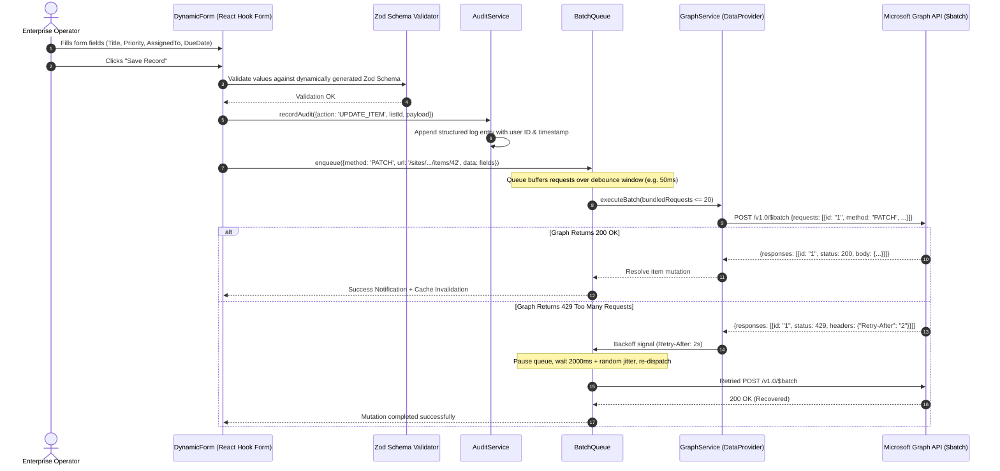

# Technical Analysis: Enterprise SharePoint Management Platform v4 (`sharepoint_manager_final_v4-main`)

## 1. Executive Summary & Goal

### Purpose & Objective
`sharepoint_manager_final_v4-main` is a high-availability, configuration-driven enterprise Single Page Application (SPA) designed to unify corporate SharePoint Online list administration, dynamic workplace schema definitions, batch operations, and role-based data governance.

### Core Problem Solved
Traditional SharePoint management interfaces are static, difficult to configure across disparate departmental workflows, and prone to Microsoft Graph rate limiting (`429 Too Many Requests`). This v4 platform delivers:
- **Configuration-Driven Workspaces**: Workspaces and menu structures are managed as runtime configurations (`initialConfig.ts`, `configService.ts`) with custom iconography, colors, and permissions.
- **Enterprise DataProvider Abstraction**: A decoupled contract (`dataProvider.ts`) supported by a live Microsoft Graph implementation (`graphService.ts`) and a comprehensive offline simulation engine (`mockDataProvider.ts`).
- **Resilient Request Batching**: A client-side queue manager (`batchQueue.ts`) that pools item mutations into Microsoft Graph `$batch` operations with automatic exponential backoff.
- **Dynamic Form Generation**: Form generation engine (`DynamicForm.tsx`, `FieldRenderer.tsx`, `PeoplePicker.tsx`, `LookupSelect.tsx`) driven by Zod schema validation and React Hook Form.

---

## 2. Architecture & Design Patterns

The system implements a **Layered, Contract-First Enterprise Architecture** combining Dependency Inversion, Context-Driven RBAC, and Micro-Front-End styled feature isolation.

```
┌──────────────────────────────────────────────────────────────────────────────────────────────────┐
│                      ENTERPRISE SHAREPOINT MANAGEMENT PLATFORM (V4) ARCHITECTURE                 │
│                                DETAILED ARCHITECTURAL BLUEPRINT                                  │
└──────────────────────────────────────────────────────────────────────────────────────────────────┘

 ┌────────────────────────────────────────────────────────────────────────────────────────────────┐
 │                                   PRESENTATION & APP SHELL LAYER                               │
 │                                                                                                │
 │   ┌────────────────────────────────────────────────────────────────────────────────────────┐   │
 │   │                       AppShell (Header, Responsive Sidebar, Breadcrumbs)               │   │
 │   │  • Tenant Branding, Workspace Switcher (Projects, Inventory, HR, Procurement, Assets)  │   │
 │   │  • Silent SSO Recovery Frame, Notification Toast Container                             │   │
 │   └───────────────────────────────────────────┬────────────────────────────────────────────┘   │
 │                                               │ Routes Navigation                              │
 │                                               ▼                                                │
 │   ┌────────────────────────────────────────────────────────────────────────────────────────┐   │
 │   │                          Feature Workspaces & Views (React Router v7)                  │   │
 │   │                                                                                        │   │
 │   │  ┌────────────────────────┐  ┌────────────────────────┐  ┌───────────────────────────┐ │   │
 │   │  │   WorkspacePage.tsx    │  │     DashboardPage.tsx  │  │      AdminPage.tsx        │ │   │
 │   │  │ • Dynamic Workspace   │  │ • KPI Summary Cards    │  │ • RBAC Matrix Editor      │ │   │
 │   │  │   Config Resolution    │  │ • Activity Stream      │  │ • Schema Overrides        │ │   │
 │   │  │ • List/Menu Routing    │  │ • SLA Monitoring View  │  │ • Audit Log Inspector     │ │   │
 │   │  └───────────┬────────────┘  └───────────┬────────────┘  └─────────────┬─────────────┘ │   │
 │   │              │                           │                             │               │   │
 │   │              ▼                           ▼                             ▼               │   │
 │   │  ┌───────────────────────────────────────────────────────────────────────────────────┐ │   │
 │   │  │                Enterprise Data Grid (DataTable.tsx & TableToolbar)                │ │   │
 │   │  │  • FilterPanel (Column-based predicates) • Sort, Fuzzy Search & Pagination        │ │   │
 │   │  └───────────────────────────────────────┬───────────────────────────────────────────┘ │   │
 │   │                                          │ Row Actions (New / Edit)                    │   │
 │   │                                          ▼                                             │   │
 │   │  ┌───────────────────────────────────────────────────────────────────────────────────┐ │   │
 │   │  │                    DynamicForm Engine (React Hook Form + Zod)                     │ │   │
 │   │  │  • FieldRenderer (Text, Number, Date, Choice, Boolean, Image)                     │ │   │
 │   │  │  • PeoplePicker.tsx (Debounced Entra ID directory search with avatar chips)       │ │   │
 │   │  │  • LookupSelect.tsx (Asynchronous foreign-key resolution from target lists)       │ │   │
 │   │  │  • Dynamic Zod Schema Generator (Runtime column constraint validation)            │ │   │
 │   │  └───────────────────────────────────────┬───────────────────────────────────────────┘ │   │
 │   └──────────────────────────────────────────┼─────────────────────────────────────────────┘   │
 └──────────────────────────────────────────────┼─────────────────────────────────────────────────┘
                                                │
                                                ▼
 ┌────────────────────────────────────────────────────────────────────────────────────────────────┐
 │                                   SECURITY & GOVERNANCE LAYER                                  │
 │                                                                                                │
 │  ┌─────────────────────────────────────────┐     ┌──────────────────────────────────────────┐  │
 │  │      AuthorizationContext & Resolver    │     │               AuditService               │  │
 │  │  • User Roles: Admin, Editor, Viewer    │     │  • Immutable structured event recorder   │  │
 │  │  • Feature Flags & Route Guard Hooks    │     │  • Logs CREATE/UPDATE/DELETE & mutations │  │
 │  │  • Granular column-level write ACLs     │     │  • Payload diffing & user correlation ID │  │
 │  └─────────────────────────────────────────┘     └──────────────────────────────────────────┘  │
 └──────────────────────────────────────────────┬─────────────────────────────────────────────────┘
                                                │
                                                ▼
 ┌────────────────────────────────────────────────────────────────────────────────────────────────┐
 │                                   SERVICE ABSTRACTION & RESILIENCE                             │
 │                                                                                                │
 │  ┌──────────────────────────────────────────────────────────────────────────────────────────┐  │
 │  │                           ConfigService (initialConfig.ts)                               │  │
 │  │ • Manages runtime workspace metadata, menu hierarchies, list UUID mappings & icons      │  │
 │  └───────────────────────────────────────────┬──────────────────────────────────────────────┘  │
 │                                              │                                                 │
 │                                              ▼                                                 │
 │  ┌──────────────────────────────────────────────────────────────────────────────────────────┐  │
 │  │                        BatchQueue (Graph $batch Pooling Manager)                         │  │
 │  │ • Aggregates individual C/U/D requests into multipart batches of <= 20 sub-requests     │  │
 │  │ • Rate-Limit Defense: Auto-retry with jittered exponential backoff on HTTP 429 & 503     │  │
 │  └───────────────────────────────────────────┬──────────────────────────────────────────────┘  │
 │                                              │                                                 │
 │                                              ▼                                                 │
 │  ┌──────────────────────────────────────────────────────────────────────────────────────────┐  │
 │  │                           DataProvider Interface (Contract-First)                        │  │
 │  │ • getListColumns(), getListItems(), createListItem(), updateListItem(), deleteListItem()  │  │
 │  │ • getLookupOptions(), searchUsers()                                                      │  │
 │  └──────────────────────┬────────────────────────────────────────────┬──────────────────────┘  │
 └─────────────────────────┼────────────────────────────────────────────┼─────────────────────────┘
                           │                                            │
                           │ Live Tenant Mode                           │ Offline Sandbox Mode
                           ▼                                            ▼
 ┌──────────────────────────────────────────────────┐ ┌───────────────────────────────────────────┐
 │       GraphService (Microsoft Graph v1.0 SDK)    │ │   MockDataProvider (Fixture Generator)    │
 │  • Authenticated via MSAL bearer tokens          │ │ • In-memory stateful list collections     │
 │  • Executes multipart $batch payloads            │ │ • Simulated network latency & errors      │
 │  • Cursor-based pagination with `@odata.nextLink`│ │ • SchemaGenerator (Dynamic field mock)    │
 └──────────────────────────────────────────────────┘ └───────────────────────────────────────────┘
```

### Dynamic Form Submission & Resilient Batching Sequence



### Architectural Distinctions (v4 vs v01)
1. **Strict Dependency Inversion**: Features never directly invoke `fetch` or the Graph SDK. All operations pass through `DataProvider`, allowing seamless switching between live production tenants and mock offline demo sandbox mode.
2. **Resilience & Batching Queue (`batchQueue.ts`)**:
   - Groups up to 20 sub-requests into a single Microsoft Graph `$batch` call.
   - Handles HTTP 429 and HTTP 503 errors with jittered exponential backoff.
3. **Enterprise Form Engine**:
   - `PeoplePicker.tsx`: Debounced Microsoft 365 Entra ID user search with avatar chips.
   - `LookupSelect.tsx`: Asynchronously resolves linked relational SharePoint list values.

---

## 3. Working & Execution Lifecycle

### 3.1 Bootstrap & Session Recovery
1. `main.tsx` initializes `msalInstance` before mounting the React root.
2. Silent SSO recovery (`ssoSilent`) is attempted within a hidden iframe for active corporate Entra ID sessions.
3. If environment variables are missing in production mode, a clean fail-safe error overlay (`ShieldAlert`) guides administrators to configure `VITE_ENTRA_CLIENT_ID` and `VITE_ENTRA_TENANT_ID`.

### 3.2 Dynamic Workspace Navigation
1. The app boots with workspaces defined in `initialConfig.ts` (e.g., *Projects*, *Inventory & Supplies*, *HR & People Operations*, *Procurement & Purchase*, *IT & Fixed Assets*).
2. Selecting a workspace reveals its associated menu items and linked SharePoint list IDs.
3. `DataTable.tsx` fetches list columns and items using `@tanstack/react-query`, honoring server-side filtering, sorting, and cursor-based pagination tokens (`nextLink`).

### 3.3 Dynamic Form Submission & Audit Trail
1. Adding or editing an item invokes `DynamicForm.tsx`, which dynamically constructs fields based on the column types (Text, Number, DateTime, Choice, Person, Boolean, Lookup).
2. On submit, fields are validated against dynamically generated Zod schemas.
3. The mutation is routed through `BatchQueue` -> `DataProvider`.
4. `AuditService` records an immutable audit entry with timestamp, user identity, action type (`CREATE_ITEM`, `UPDATE_ITEM`), and targeted site/list identifier.

---

## 4. Tech Stack & Dependencies

| Area | Technology | Version / Details |
|---|---|---|
| **Core Framework** | React 19 + TypeScript | `react:19.0.1`, `typescript:~5.8.2`, `vite:^6.2.3` |
| **Authentication** | MSAL Browser & MSAL React | `@azure/msal-browser:^5.18.0`, `@azure/msal-react:^5.5.5` |
| **Data Fetching** | TanStack React Query | `@tanstack/react-query:^5.101.4` |
| **Form Management** | React Hook Form & Zod | `react-hook-form:^7.85.0`, `zod:^4.4.3`, `@hookform/resolvers:^5.7.1` |
| **Global State** | Zustand | `zustand:^5.0.14` |
| **Styling & Icons** | Tailwind CSS v4 & Lucide | `@tailwindcss/vite:^4.1.14`, `lucide-react:^0.546.0` |
| **Animation Engine**| Motion | `motion:^12.23.24` |
| **AI Integration** | Google GenAI SDK | `@google/genai:^2.4.0` |
| **Testing** | Vitest | `vitest:^4.1.10` |

---

## 5. Goals & Target Audience

- **Target Audience**: Corporate IT teams, compliance officers, and line-of-business managers running operational data workflows across multiple SharePoint sites.
- **Goal**: Provide an enterprise-grade control plane that turns raw SharePoint lists into structured, branded corporate workspaces with automated batching, audit logging, and role-based permissions.

---

## 6. Limitations & Technical Debt

1. **Client-Side Audit Storage**: The default `auditService.ts` records audit trails in client memory and `localStorage`. For regulatory compliance (SOX, HIPAA, GDPR), logs must be forwarded to an Azure Log Analytics workspace or Cosmos DB sink.
2. **Schema Introspection Overhead**: Dynamically introspecting list columns and dependent lookup lists on every workspace change requires multiple round-trips to Microsoft Graph; aggressive React Query caching is required to prevent sluggish navigation.
3. **File Attachments & Document Libraries**: While list items and relational fields are fully supported, document library management (file check-in/check-out, version history diffing) is not yet surfaced in the UI.
