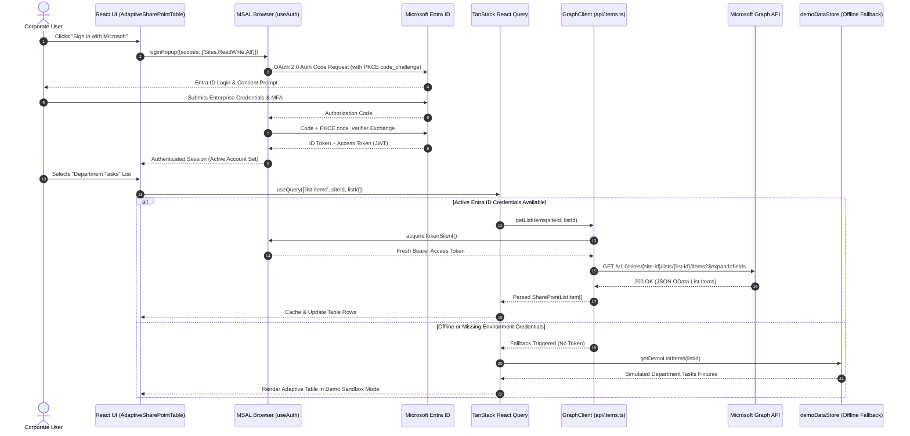

# Technical Analysis: SharePoint Management Platform v01 (`sharepoint_project_v01-main`)

## 1. Executive Summary & Goal

### Purpose & Objective
`sharepoint_project_v01-main` is a modern single-page web application (SPA) designed to administer Microsoft SharePoint Online lists, list items, schemas, and permissions through Microsoft Graph API and Microsoft Entra ID (Azure AD).

### Core Problem Solved
The native SharePoint web interface is often slow, fragmented across administrative menus, and difficult to customize for rapid data entry or operational workflows. This platform provides:
- A responsive, low-latency table UI powered by TanStack Table and Tailwind CSS.
- First-class support for custom column schema editing (text, choice, lookup, dateTime, currency).
- Dynamic permissions management for users, security groups, and site roles.
- An intelligent fallback demo mode (`demoDataStore.ts`) that allows offline development and interface preview without active Azure credentials.

---

## 2. Architecture & Design Patterns

The application adheres to a modular **Feature-Based React Architecture** with clean separation between authentication, Graph API abstractions, Zustand state management, and presentational components.

```
┌──────────────────────────────────────────────────────────────────────────────────────────────────┐
│                          SHAREPOINT MANAGEMENT PLATFORM (V01) ARCHITECTURE                       │
│                                DETAILED ARCHITECTURAL BLUEPRINT                                  │
└──────────────────────────────────────────────────────────────────────────────────────────────────┘

 ┌────────────────────────────────────────────────────────────────────────────────────────────────┐
 │                                   CLIENT BROWSER (REACT 19 + VITE)                             │
 │                                                                                                │
 │   ┌────────────────────────────────────────────────────────────────────────────────────────┐   │
 │   │                       Identity & Access Management (MSAL Browser)                      │   │
 │   │  • PublicClientApplication (PKCE Flow, Multi-Tenant / Single-Tenant Support)           │   │
 │   │  • useAuth() Hook: loginPopup(), loginRedirect(), acquireTokenSilent(), logout()       │   │
 │   │  • Scopes: Sites.Read.All, Sites.ReadWrite.All, Sites.Manage.All, User.Read            │   │
 │   └───────────────────────────────────────────┬────────────────────────────────────────────┘   │
 │                                               │ Bearer Access Token                            │
 │                                               ▼                                                │
 │   ┌────────────────────────────────────────────────────────────────────────────────────────┐   │
 │   │                           Navigation & Shell (React Router v7)                         │   │
 │   │  • SharePointSidebar: Site Connection Switcher, Navigation Links, ConnectionStatusChip │   │
 │   │  • ThemeToggle: Dark / Light Mode LocalStorage Persistence                             │   │
 │   └───────────────────────────────────────────┬────────────────────────────────────────────┘   │
 │                                               │                                                │
 │         ┌─────────────────────────────────────┼─────────────────────────────────────┐          │
 │         ▼                                     ▼                                     ▼          │
 │  ┌─────────────────────────────┐ ┌─────────────────────────────┐ ┌─────────────────────────┐  │
 │  │        Feature: Lists       │ │       Feature: Items        │ │ Feature: Schema/Perms   │  │
 │  │ • ListBrowser.tsx           │ │ • ItemGrid.tsx              │ │ • ColumnEditor.tsx      │  │
 │  │ • ListDetail.tsx            │ │ • AdaptiveSharePointTable   │ │ • ViewEditor.tsx        │  │
 │  │ • Site Collection Inspector │ │ • Dynamic Field Renderers   │ │ • PermissionsPanel.tsx  │  │
 │  │ • Template Creator          │ │ • NewRow / EditRow Modals   │ │ • Role Definitions      │  │
 │  └──────────────┬──────────────┘ └──────────────┬──────────────┘ └────────────┬────────────┘  │
 │                 │                               │                             │                │
 │                 ▼                               ▼                             ▼                │
 │   ┌────────────────────────────────────────────────────────────────────────────────────────┐   │
 │   │                       Client State & Query Layer (Zustand & TanStack)                  │   │
 │   │  • TanStack React Query: Cache invalidation, background refetch, pagination queries    │   │
 │   │  • listsStore: Active List, Column Schemas, Selected Rows                              │   │
 │   │  • connectionsStore: Active Site URL, Saved Tenants, Custom App Registrations          │   │
 │   │  • demoDataStore: Offline mock lists, items, and departments (Fallback engine)         │   │
 │   └───────────────────────────────────────────┬────────────────────────────────────────────┘   │
 │                                               │ Query Functions                                │
 │                                               ▼                                                │
 │   ┌────────────────────────────────────────────────────────────────────────────────────────┐   │
 │   │                           Data Access Layer (Microsoft Graph SDK)                      │   │
 │   │  • graphClient.ts: Configured Client instance with MSAL AuthenticationProvider         │   │
 │   │  • api/lists.ts:        GET /sites/{site-id}/lists, POST /lists                        │   │
 │   │  • api/items.ts:        GET /items, POST /items, PATCH /items/{id}, DELETE /items      │   │
 │   │  • api/schema.ts:       GET /columns, POST /columns (Text, Choice, Lookup, Date)       │   │
 │   │  • api/permissions.ts:  GET /permissions, POST /permissions (Read/Write/Full)         │   │
 │   └──────────────────────┬─────────────────────────────────────────────────────────────────┘   │
 └──────────────────────────┼─────────────────────────────────────────────────────────────────────┘
                            │
            HTTPS REST APIs │ (OAuth Bearer Authorization)
                            ▼
 ┌────────────────────────────────────────────────────────────────────────────────────────────────┐
 │                                   MICROSOFT 365 CLOUD ENVIRONMENT                              │
 │                                                                                                │
 │   ┌───────────────────────────────────┐               ┌────────────────────────────────────┐   │
 │   │        Microsoft Entra ID         │               │     Microsoft Graph API (v1.0)     │   │
 │   │  • OAuth 2.0 PKCE Token Authority │               │  • /sites/{site-id}/lists          │   │
 │   │  • Tenant Directory & User Roles  │               │  • /lists/{list-id}/columns        │   │
 │   └───────────────────────────────────┘               │  • /lists/{list-id}/items          │   │
 │                                                       └─────────────────┬──────────────────┘   │
 │                                                                         │                      │
 │                                                                         ▼                      │
 │                                                       ┌────────────────────────────────────┐   │
 │                                                       │     SharePoint Online Service      │   │
 │                                                       │  • Site Collections & Document Libs│   │
 │                                                       │  • Custom List Schemas & Items     │   │
 │                                                       │  • Role Assignments & Permissions  │   │
 │                                                       └────────────────────────────────────┘   │
 └────────────────────────────────────────────────────────────────────────────────────────────────┘
```

### End-to-End Authentication & Graph Data Query Sequence



### Core Architectural Patterns
1. **Hybrid Live/Mock Data Architecture**:
   - `graphClient.ts` authenticates against Microsoft Graph using MSAL bearer tokens.
   - If Entra ID credentials (`VITE_AZURE_CLIENT_ID`, `VITE_AZURE_TENANT_ID`) are absent, the application gracefully mounts `demoDataStore` with rich sample departments, mock SharePoint lists, and sample items.
2. **Declarative Data Fetching**:
   - Utilizes `@tanstack/react-query:5.103.2` for automatic cache invalidation, background refetching, optimistic updates, and loading/error boundary states.
3. **Global Lightweight State**:
   - Zustand stores (`listsStore.ts`, `connectionsStore.ts`, `uiStore.ts`, `themeStore.ts`) manage active site connections, modal visibility, and dark/light mode persistence in `localStorage`.

---

## 3. Working & Execution Lifecycle

### 3.1 Authentication Workflow (OAuth 2.0 PKCE)
1. On app boot, `msalConfig.ts` instantiates `PublicClientApplication` with redirect/popup interaction types.
2. The user initiates login via `useAuth().login()`.
3. MSAL redirects to Microsoft Entra ID login, requesting scopes:
   - `Sites.Read.All`, `Sites.ReadWrite.All`, `Sites.Manage.All`, `User.Read`.
4. Upon return, MSAL acquires and caches access tokens, injecting them into the `AuthProvider` for Microsoft Graph client requests.

### 3.2 List & Item Management Flow
1. **Site Discovery**: The user connects to a SharePoint site collection URL (e.g., `https://contoso.sharepoint.com/sites/Marketing`).
2. **List Introspection**: `api/lists.ts` invokes `GET /sites/{site-id}/lists` to fetch list metadata, column definitions, and views.
3. **Data Rendering**: `AdaptiveSharePointTable.tsx` dynamically builds table columns matching the SharePoint field definitions (Text, Choice tags, User person chips, DateTime formats).
4. **CRUD Actions**:
   - **Create**: `NewRowModal.tsx` validates inputs and dispatches `POST /sites/{site-id}/lists/{list-id}/items`.
   - **Update**: `EditRowModal.tsx` triggers `PATCH /sites/{site-id}/lists/{list-id}/items/{item-id}/fields`.
   - **Delete**: `DeleteRowConfirmModal.tsx` fires `DELETE /sites/{site-id}/lists/{list-id}/items/{item-id}`.

### 3.3 Dynamic Schema Customization
- `ColumnEditor.tsx` allows administrators to provision new SharePoint list columns directly from the web interface without navigating through SharePoint Site Settings.

---

## 4. Tech Stack & Dependencies

| Category | Library / Tool | Details |
|---|---|---|
| **Core Framework** | React 19 + TypeScript | `react:19.0.1`, `typescript:7.0.2`, `vite:8.3.0` |
| **Authentication** | MSAL Browser & React | `@azure/msal-browser:5.22.0`, `@azure/msal-react:5.7.1` |
| **Graph Client** | Microsoft Graph SDK | `@microsoft/microsoft-graph-client:3.0.7` |
| **Server State & Cache**| TanStack Query | `@tanstack/react-query:5.103.2` |
| **Data Tables** | TanStack Table | `@tanstack/react-table:8.20.6` |
| **Client State** | Zustand | `zustand:5.0.15` |
| **Styling & Icons** | Tailwind CSS & Lucide | `@tailwindcss/vite:4.3.3`, `lucide-react:0.546.0` |
| **Routing** | React Router | `react-router-dom:7.18.4` |
| **Validation** | Zod | `zod:4.6.5` |

---

## 5. Goals & Target Audience

- **Target Audience**: SharePoint administrators, M365 power users, department leads, and operations teams managing internal records and workflows.
- **Goal**: Provide a clean, snappy, enterprise-grade replacement for default SharePoint List interfaces with built-in multi-site connection switching and offline demo simulation.

---

## 6. Limitations & Technical Debt

1. **Large List Threshold (5000+ Items)**: SharePoint Graph API enforces list view thresholds. Querying unfiltered lists exceeding 5,000 items requires indexed column filtering and cursor pagination (`@odata.nextLink`), which is only partially paginated in client views.
2. **Lookup & Person Column Resolution**: Graph API represents Person and Lookup fields as nested objects or integer IDs. Resolving person profile photos or lookup target titles requires supplementary Graph requests, causing potential latency.
3. **No Batching API**: Bulk creating or deleting items issues individual HTTP requests rather than leveraging Microsoft Graph `$batch` requests.
4. **Pure Client-Side Secrets**: As an SPA, this app relies on client-side public client MSAL authentication. It cannot perform daemon or application-level actions without delegated user sign-in.
