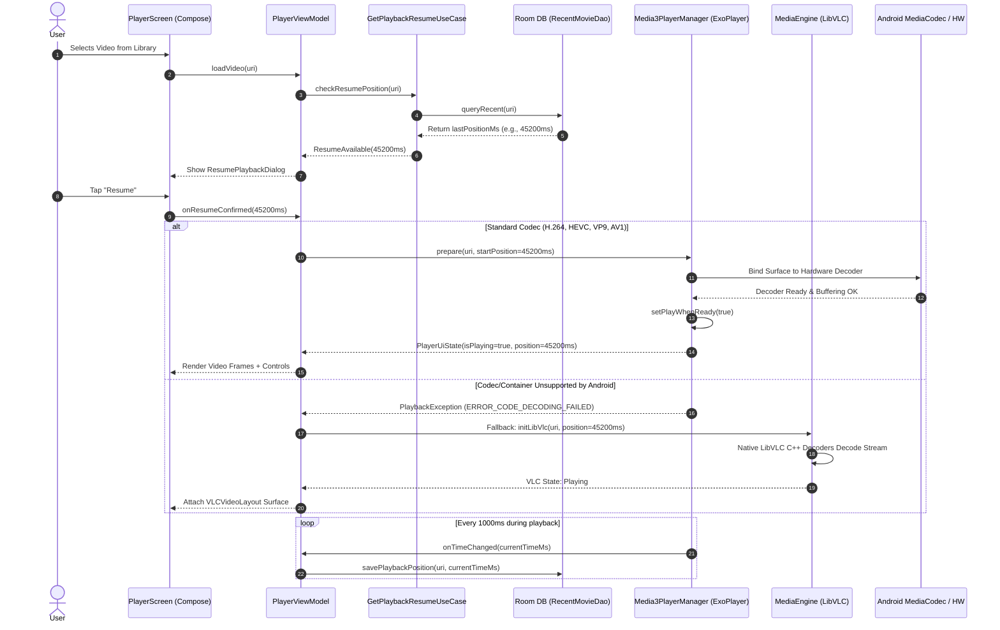

# Technical Analysis: WatchTogether Local Video Player (`video_player-main`)

## 1. Executive Summary & Goal

### Purpose & Objective
`video_player-main` is a high-performance, native Android local media player application built with modern Android development paradigms. It provides a cinematic, hardware-accelerated playback experience for local video files stored on device storage or external SD cards.

### Core Problem Solved
Default system media players often lack support for advanced container formats, external subtitle tracks (.srt, .vtt, .ass), robust resume capabilities, gesture-driven controls, and failover decoding for non-standard codecs. This application provides:
- Dual-engine playback (AndroidX Media3 ExoPlayer with fallback to LibVLC for complex codecs).
- Complete local database tracking for playback positions, favorites, and history.
- Intuitive gesture-based controls for volume, brightness, and seeking.
- Scoped storage compliance using both MediaStore APIs and Storage Access Framework (SAF).

---

## 2. Architecture & Design Patterns

The application strictly implements **Clean Architecture** combined with **MVVM (Model-View-ViewModel)** and **Unidirectional Data Flow (UDF)**.

```
┌──────────────────────────────────────────────────────────────────────────────────────────────────┐
│                                 WATCHTOGETHER LOCAL VIDEO PLAYER                                 │
│                                 DETAILED ARCHITECTURAL BLUEPRINT                                 │
└──────────────────────────────────────────────────────────────────────────────────────────────────┘

 ┌────────────────────────────────────────────────────────────────────────────────────────────────┐
 │                                   PRESENTATION LAYER (JETPACK COMPOSE)                         │
 │                                                                                                │
 │  ┌───────────────────────────┐      ┌───────────────────────────┐      ┌─────────────────────┐ │
 │  │      HomeScreen UI        │      │      FolderVideosScreen   │      │   SettingsScreen    │ │
 │  │  • Video Grid / Bucket List│      │  • Subdirectory Explorer  │      │ • HW Acceleration   │ │
 │  │  • Search & Sort Bar      │      │  • Batch Selection Bar    │      │ • Aspect Ratio Prefs│ │
 │  └─────────────┬─────────────┘      └─────────────┬─────────────┘      └──────────┬──────────┘ │
 │                │                                  │                               │            │
 │                ▼                                  ▼                               │            │
 │  ┌──────────────────────────────────────────────────────────────┐                 │            │
 │  │                      HomeViewModel                           │                 │            │
 │  │  • uiState: StateFlow<HomeUiState>                           │                 │            │
 │  │  • scanVideos(), toggleFavorite(), filterByBucket()          │                 │            │
 │  └──────────────────────────────┬───────────────────────────────┘                 │            │
 │                                 │                                                 │            │
 │  ┌──────────────────────────────┴─────────────────────────────────────────────────┴──────────┐ │
 │  │                                    PlayerScreen UI                                        │ │
 │  │  ┌───────────────────────┐  ┌────────────────────────┐  ┌───────────────────────────────┐ │ │
 │  │  │  DoubleTapSeekOverlay │  │ PlayerGestureOverlay   │  │   TrackSelectionSheet         │ │ │
 │  │  │  • Skip +/- 10s       │  │ • Brightness (Left Drag│  │   • Audio Track Selector      │ │ │
 │  │  │  • Smooth Ripple Anim │  │ • Volume (Right Drag)  │  │   • Subtitle Track Selector   │ │ │
 │  │  │  • Seek Preview Text  │  │ • Horizontal Scrubbing │  │   • External Subtitle (.srt)  │ │ │
 │  │  └───────────────────────┘  └────────────────────────┘  └───────────────────────────────┘ │ │
 │  │  ┌──────────────────────────────────────────────────────────────────────────────────────┐ │ │
 │  │  │            PlayerControls (CinematicTopBar & CinematicBottomControls)                │ │ │
 │  │  │  • Play/Pause/Rewind/FastFwd • Time Indicators • Aspect Ratio • Lock Screen Toggle   │ │ │
 │  │  └──────────────────────────────────────────────────────────────────────────────────────┘ │ │
 │  │  ┌──────────────────────────────────────────────────────────────────────────────────────┐ │ │
 │  │  │         AndroidView Container: ExoPlayer PlayerView / VLCVideoLayout                 │ │ │
 │  │  └──────────────────────────────────────────────────────────────────────────────────────┘ │ │
 │  └──────────────────────────────┬────────────────────────────────────────────────────────────┘ │
 │                                 │ StateFlow / Events                                           │
 │                                 ▼                                                              │
 │  ┌───────────────────────────────────────────────────────────────────────────────────────────┐ │
 │  │                                     PlayerViewModel                                       │ │
 │  │  • State: StateFlow<PlayerUiState> (Position, Duration, Playing, Buffering, Errors)       │ │
 │  │  • Events: SharedFlow<PlayerEvent> (Navigation, Dialogs, Track Changes)                   │ │
 │  │  • Methods: play(), pause(), seekTo(), setSpeed(), setTrack(), setSubtitleUri()          │ │
 │  └──────────────────────────────┬────────────────────────────────────────────────────────────┘ │
 └─────────────────────────────────┼──────────────────────────────────────────────────────────────┘
                                   │ Invokes UseCases
                                   ▼
 ┌────────────────────────────────────────────────────────────────────────────────────────────────┐
 │                                       DOMAIN LAYER (BUSINESS LOGIC)                            │
 │                                                                                                │
 │  ┌──────────────────────────┐  ┌──────────────────────────┐  ┌──────────────────────────────┐  │
 │  │   ScanVideosUseCase      │  │    GetLibraryUseCase     │  │   GetPlaybackResumeUseCase   │  │
 │  │ • Dispatches I/O scans   │  │ • Aggregates media files │  │ • Queries last position      │  │
 │  │ • Reconciles MediaStore  │  │ • Emits reactive library │  │ • Threshold validation       │  │
 │  └─────────────┬────────────┘  └─────────────┬────────────┘  └──────────────┬───────────────┘  │
 │                │                             │                              │                  │
 │  ┌─────────────┴────────────┐  ┌─────────────┴────────────┐                 │                  │
 │  │ SavePlaybackPosUseCase   │  │  ToggleFavoriteUseCase   │                 │                  │
 │  │ • Saves offset in ms     │  │ • Updates favorite status│                 │                  │
 │  └─────────────┬────────────┘  └─────────────┬────────────┘                 │                  │
 │                │                             │                              │                  │
 │                ▼                             ▼                              ▼                  │
 │  ┌──────────────────────────────────────────────────────────────────────────────────────────┐  │
 │  │                             Repository Interfaces (Contracts)                            │  │
 │  │ • VideoRepository       • PlaybackRepository       • SubtitleRepository                  │  │
 │  └───────────────────────────────────────────┬──────────────────────────────────────────────┘  │
 └──────────────────────────────────────────────┼─────────────────────────────────────────────────┘
                                                │ Implements Contracts
                                                ▼
 ┌────────────────────────────────────────────────────────────────────────────────────────────────┐
 │                               DATA & MEDIA ENGINE LAYER (DRIVERS)                              │
 │                                                                                                │
 │  ┌────────────────────────────────────────────────┐  ┌──────────────────────────────────────┐  │
 │  │             PlaybackRepositoryImpl             │  │          VideoRepositoryImpl         │  │
 │  │  • Coordinates DB and Player Preferences       │  │  • Merges MediaStore and SAF caches  │  │
 │  └──────────────┬───────────────────────┬─────────┘  └──────────┬───────────────────────────┘  │
 │                 │                       │                       │                              │
 │                 ▼                       ▼                       ▼                              │
 │  ┌─────────────────────────┐ ┌──────────────────────┐ ┌─────────────────────────────────────┐  │
 │  │   MediaDatabase (Room)  │ │ PlayerPreferences    │ │ Data Sources:                       │  │
 │  │ • RecentMovieDao        │ │ • Jetpack DataStore  │ │ • MediaStoreDataSource (MediaStore) │  │
 │  │ • History, Bookmarks    │ │ • HW Decoding toggle │ │ • SafDataSource (Scoped Storage)    │  │
 │  │ • Playback Offsets (ms) │ │ • Default zoom/speed │ │ • ThumbnailLoader (Bitmap Cache)    │  │
 │  └─────────────────────────┘ └──────────────────────┘ └─────────────────────────────────────┘  │
 │                                                                                                │
 │  ┌──────────────────────────────────────────────────────────────────────────────────────────┐  │
 │  │                         DUAL-ENGINE MEDIA ABSTRACTION (`VideoPlayer`)                    │  │
 │  │                                                                                          │  │
 │  │  ┌───────────────────────────────────────────┐  ┌──────────────────────────────────────┐ │  │
 │  │  │   Primary: Media3PlayerManager (ExoPlayer)│  │    Secondary: MediaEngine (LibVLC)   │ │  │
 │  │  │  • androidx.media3.exoplayer:1.3.1        │  │  • org.videolan.libvlc:libvlc-all    │ │  │
 │  │  │  • MediaCodec Hardware Decoders           │  │  • Native FFmpeg/C/C++ Decoders     │ │  │
 │  │  │  • DefaultTrackSelector (Audio/Subtitles) │  │  • Fallback for exotic containers    │ │  │
 │  │  │  • MediaSession Audio Focus & Headset Int │  │  • Embedded VLCVideoLayout Surface   │ │  │
 │  │  └───────────────────────────────────────────┘  └──────────────────────────────────────┘ │  │
 │  └──────────────────────────────────────────────────────────────────────────────────────────┘  │
 └────────────────────────────────────────────────────────────────────────────────────────────────┘
```

### End-to-End Playback Execution & Data Flow



### Architectural Highlights
- **Dual Media Engine Abstraction**:
  - `Media3PlayerManager.kt`: Implements `VideoPlayer` utilizing `androidx.media3.exoplayer:1.3.1` for hardware decoding, MediaSession integration, audio focus management, and track selection.
  - `MediaEngine.kt`: Utilizes `org.videolan.libvlc:libvlc-all` as a resilient secondary engine for formats and codecs unsupported by standard Android MediaCodec decoders.
- **Data Persistence**:
  - Room Database (`MediaDatabase.kt` / `VideoDatabase.kt`): Stores `RecentMovieEntity`, bookmarks, timestamps, and favorite flags.
  - Jetpack DataStore (`PlayerPreferences.kt`): Stores user preferences (hardware acceleration toggle, default aspect ratio, audio boost preferences).
- **Reactive UI Flow**:
  - Uses Kotlin Coroutines, `StateFlow<PlayerUiState>`, and `SharedFlow<PlayerEvent>` ensuring unidirectional state propagation from ViewModels to Jetpack Compose Composables.

---

## 3. Working & Execution Flow

### 3.1 Media Discovery & Indexing
1. **Permission Handling**: Requests `READ_MEDIA_VIDEO` (Android 13+) or `READ_EXTERNAL_STORAGE` (Android 12 and below).
2. **MediaStore Scan**: `MediaStoreDataSource` queries the system content resolver for video content URIs, duration, mime types, file sizes, and folder buckets.
3. **SAF Directory Picker**: For custom or restricted folders (such as SD card paths), `SafDataSource` leverages Android's Storage Access Framework with persistent URI permissions.
4. **Thumbnail Generation**: `ThumbnailLoader` asynchronously decodes video frames into cached bitmaps for smooth grid rendering.

### 3.2 Playback Lifecycle
1. **Selection & Resume Check**: When a user selects a video, `GetPlaybackResumeUseCase` queries the database for existing playback progress. If the user previously watched beyond a threshold (> 5 seconds and < 95% completion), a `ResumePlaybackDialog` is presented.
2. **Player Engine Instantiation**:
   - `Media3PlayerManager` configures `ExoPlayer` with `DefaultRenderersFactory` (preferring hardware decoders) and `DefaultTrackSelector`.
   - Attaches to `PlayerView` wrapped in a Compose `AndroidView`.
3. **External Subtitle Parsing**: Scans the directory of the selected video for matching `.srt`, `.vtt`, and `.sub` files, attaching them as supplementary `MediaItem.SubtitleConfiguration`.
4. **Playback Position Tracking**: A coroutine loop periodically persists playback progress to Room via `SavePlaybackPositionUseCase` every 1000ms and on player pause/stop.

### 3.3 Interactive Touch & Gesture Controls
- **Left Vertical Drag**: Adjusts screen brightness dynamically.
- **Right Vertical Drag**: Adjusts device media volume.
- **Horizontal Drag**: Fast-forward / Rewind seek preview with millisecond precision.
- **Double-Tap**: 10-second skip forward / backward with ripple animation (`DoubleTapSeekOverlay.kt`).

---

## 4. Tech Stack & Dependencies

| Layer | Technology | Details |
|---|---|---|
| **Language & Platform** | Kotlin 2.0+ / Android SDK | `minSdk = 24`, `targetSdk = 36`, `compileSdk = 36` |
| **UI Framework** | Jetpack Compose + Material 3 | Compose BOM `2024.05.00`, Material Icons Extended |
| **Primary Video Engine** | AndroidX Media3 (ExoPlayer) | `media3-exoplayer:1.3.1`, `media3-ui`, `media3-session` |
| **Secondary Video Engine**| LibVLC Android | `org.videolan.android:libvlc-all:3.6.0-eap13` |
| **Local Database** | Room ORM | `androidx.room:room-runtime:2.6.1`, `room-ktx`, KSP compiler |
| **Key-Value Storage** | Jetpack DataStore | `androidx.datastore:datastore-preferences:1.1.1` |
| **Concurrency** | Kotlin Coroutines & Flow | `kotlinx-coroutines-android:1.8.0` |
| **Testing** | Robolectric & Roborazzi | Screenshot testing via `roborazzi`, Unit tests via `junit` |

---

## 5. Goals & Target Audience

- **Target Audience**: Users seeking a privacy-first, ad-free, high-fidelity offline video player on Android without telemetry or third-party ads.
- **Goal**: Deliver a VLC / MX Player alternative utilizing modern Jetpack Compose UI with instant video loading, track switching (audio/subtitles), and background playback management.

---

## 6. Limitations & Technical Debt

1. **No Network / Cloud Streaming**: Only plays local files stored on the device or accessible through SAF. Does not support UPnP/DLNA, SMB network shares, or direct URL streaming.
2. **Memory Footprint of LibVLC**: Including `libvlc-all` bundles multiple native `.so` binaries (ARMv7, ARM64, x86, x86_64), noticeably increasing the output APK size (~40MB+).
3. **Background Audio & PiP**: Picture-in-Picture (PiP) and background audio service lifecycle requires full foreground service declaration which is partially implemented.
4. **Scoped Storage Limitations**: On Android 11+ (API 30+), deleting or renaming files on external storage requires user consent dialogs via `MediaStore.createTrashRequest` or `createWriteRequest`, which can interrupt batch operations.
