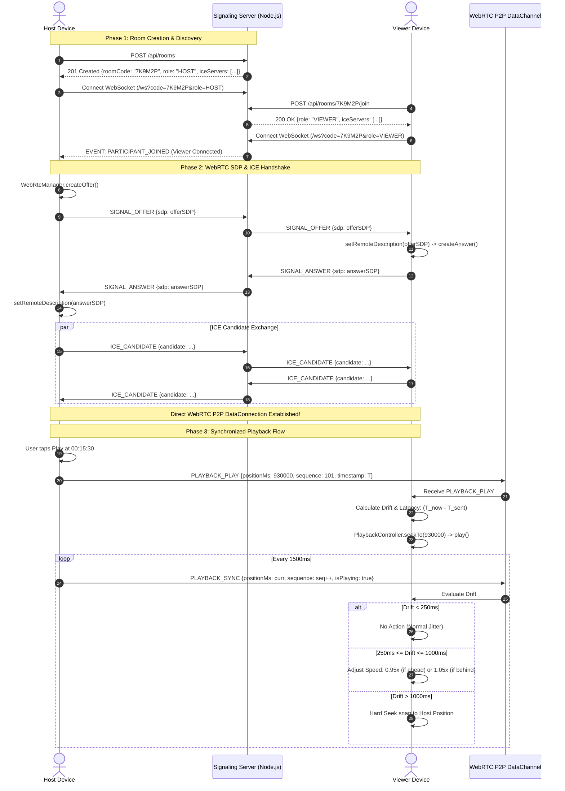

# Technical Analysis: WatchTogether Hybrid Suite (`watch_together_android_app-main`)

## 1. Executive Summary & Goal

### Purpose & Objective
`watch_together_android_app-main` is a native Android collaborative entertainment platform that pairs an existing local media player (Media3 ExoPlayer & LibVLC) with an embedded WebRTC and WebSocket peer-to-peer synchronization engine. It allows two users (Host and Viewer) to watch local video files together in real time without uploading movie files to any third-party server or cloud storage.

### Core Problem Solved
Streaming personal or local high-definition video files with friends normally requires uploading gigabytes of data to cloud providers (e.g., Google Drive, Plex, or YouTube), incurring high bandwidth costs, compression artifacts, and privacy concerns. WatchTogether solves this by:
- Preserving 100% of the host's existing local video player without rewriting core decoding logic.
- Transmitting media directly peer-to-peer (via WebRTC or local LAN HTTP 206 streaming).
- Ensuring sub-second playback synchronization using time-offset estimation, drift correction thresholds, and monotonic sequence numbering.
- Providing an ephemeral 6-character room code system that requires zero user registration or persistent accounts.

---

## 2. Architecture & Design Patterns

The system implements a **Host-Authoritative Client-Server & P2P Hybrid Architecture**.

```
┌──────────────────────────────────────────────────────────────────────────────────────────────────┐
│                             WATCHTOGETHER HYBRID SUITE ARCHITECTURE                              │
│                                DETAILED ARCHITECTURAL BLUEPRINT                                  │
└──────────────────────────────────────────────────────────────────────────────────────────────────┘

 ┌────────────────────────────────────────────────────────────────────────────────────────────────┐
 │                                   HOST DEVICE (ANDROID CLIENT)                                 │
 │                                                                                                │
 │   ┌────────────────────────────────────────────────────────────────────────┐                   │
 │   │                             UI Layer                                   │                   │
 │   │  • WatchTogetherStartScreen (Create Room, Room Code Display)           │                   │
 │   │  • RoomSessionScreen (HUD Overlay, Drift Indicator, Player Surface)   │                   │
 │   └───────────────────────────────────┬────────────────────────────────────┘                   │
 │                                       │ StateFlow & Intent Triggers                            │
 │                                       ▼                                                        │
 │   ┌────────────────────────────────────────────────────────────────────────┐                   │
 │   │                       WatchTogetherViewModel                           │                   │
 │   │  • Manages Room Lifecycle (IDLE -> CREATING -> WAITING -> ACTIVE)      │                   │
 │   │  • Connects PlaybackSyncManager to UI events & room state flows        │                   │
 │   └───────────────────────────────────┬────────────────────────────────────┘                   │
 │                                       │ Delegates Controls & Sync                              │
 │                                       ▼                                                        │
 │   ┌────────────────────────────────────────────────────────────────────────┐                   │
 │   │                        PlaybackSyncManager (Host)                      │                   │
 │   │  • Authoritative State Authority (isPlaying, positionMs, sequence++)  │                   │
 │   │  • 1500ms Periodic SYNC Tick Dispatcher                                │                   │
 │   │  • Remote-Update Guard: isRemoteUpdate = true to prevent echo loops    │                   │
 │   └───────────────┬───────────────────┬───────────────────┬────────────────┘                   │
 │                   │                   │                   │                                    │
 │    Commands & Sync│                   │                   │                                    │
 │                   ▼                   ▼                   ▼                                    │
 │   ┌────────────────────────┐ ┌─────────────────┐ ┌─────────────────────────┐                   │
 │   │ ExistingPlayerAdapter  │ │ SignalingClient │ │ LocalMediaServer        │                   │
 │   │ • Wraps VideoPlayer    │ │ • OkHttp WSS    │ │ • Embedded HTTP Server  │                   │
 │   │ • play(), pause()      │ │ • Auto-Reconnect│ │ • 206 Partial Content   │                   │
 │   │ • seekTo(), getPos()   │ │ • Heartbeat Ping│ │ • Ephemeral Port Bind   │                   │
 │   └───────────────┬────────┘ └────────┬────────┘ └────────────┬────────────┘                   │
 │                   │                   │                       │                                │
 │                   ▼                   │                       │                                │
 │   ┌────────────────────────┐          │                       │ Direct Wi-Fi LAN               │
 │   │ Existing VideoPlayer   │          │                       │ Byte-Range Stream              │
 │   │ • Media3 ExoPlayer     │          │                       │ (Zero Cloud Latency)           │
 │   │ • Local SAF Video File │          │                       │                                │
 │   └────────────────────────┘          │                       │                                │
 └───────────────────────────────────────┼───────────────────────┼────────────────────────────────┘
                                         │                       │
                               WebSocket │ JSON Signaling        │
                                         ▼                       │
 ┌───────────────────────────────────────────────────────────────┼────────────────────────────────┐
 │                       SIGNALING & ROOM BACKEND (NODE.JS + WS) │                                │
 │                                                               │                                │
 │   ┌───────────────────────────────────────────────────────┐   │                                │
 │   │                    REST API Server                    │   │                                │
 │   │  • POST   /api/rooms           -> Create 6-char Room  │   │                                │
 │   │  • POST   /api/rooms/:code/join-> Viewer Auth Slot    │   │                                │
 │   │  • GET    /api/rooms/:code     -> Status / TTL Check  │   │                                │
 │   └───────────────────────────┬───────────────────────────┘   │                                │
 │                               │                               │                                │
 │                               ▼                               │                                │
 │   ┌───────────────────────────────────────────────────────┐   │                                │
 │   │                    WebSocket Server                   │   │                                │
 │   │  • /ws?roomCode={CODE}&peerId={ID}&role={HOST|VIEWER} │   │                                │
 │   │  • SDP Offer / Answer Exchange Router                 │   │                                │
 │   │  • ICE Candidate Forwarding                           │   │                                │
 │   │  • Fallback Playback Command Broadcast                │   │                                │
 │   └───────────────────────────┬───────────────────────────┘   │                                │
 │                               │                               │                                │
 │                               ▼                               │                                │
 │   ┌───────────────────────────────────────────────────────┐   │                                │
 │   │                      RoomManager                      │   │                                │
 │   │  • Map<roomCode, RoomSession> (In-Memory, Max 2 Peers)│   │                                │
 │   │  • Room TTL Engine (24-hour automatic eviction)       │   │                                │
 │   │  • IP Rate Limiter (Brute-force protection)           │   │                                │
 │   └───────────────────────────────────────────────────────┘   │                                │
 └───────────────────────────────────────────────────────────────┼────────────────────────────────┘
                                         ▲                       │
                               WebSocket │ JSON Signaling        │
                                         │                       │
 ┌───────────────────────────────────────┼───────────────────────┼────────────────────────────────┐
 │                                  VIEWER DEVICE (ANDROID CLIENT│                                │
 │                                                               │                                │
 │   ┌───────────────────────────────────────────────────────┐   │                                │
 │   │                    SignalingClient                    │   │                                │
 │   │  • Receives SDP Offers, ICE candidates, Room Events   │   │                                │
 │   └───────────────────────────┬───────────────────────────┘   │                                │
 │                               │                               │                                │
 │                               ▼                               │                                │
 │   ┌───────────────────────────────────────────────────────┐   │                                │
 │   │                     WebRtcManager                     │   │                                │
 │   │  • Establishes P2P PeerConnection                     │   │                                │
 │   │  • Manages DataChannels: control, file, chat          │   │                                │
 │   └───────────────────────────┬───────────────────────────┘   │                                │
 │                               │                               │                                │
 │                               ▼                               │                                │
 │   ┌───────────────────────────────────────────────────────┐   │                                │
 │   │              PlaybackSyncManager (Viewer)             │   │                                │
 │   │  • Adaptive Drift Detection:                          │   │                                │
 │   │    - Drift < 250ms  -> Ignore (Jitter)                │   │                                │
 │   │    - 250ms - 1000ms -> Smooth Speed Adjustment (0.95x/│   │                                │
 │   │    - Drift > 1000ms -> Hard Seek snap to Host Pos     │   │                                │
 │   └───────────────────────────┬───────────────────────────┘   │                                │
 │                               │                               │                                │
 │                               ▼                               ▼                                │
 │   ┌────────────────────────────────────────────────────────────────────────┐                   │
 │   │               ExistingPlayerAdapter -> VideoPlayer (ExoPlayer)         │                   │
 │   │  • Receives direct LAN stream from LocalMediaServer OR chunk cache     │                   │
 │   │  • Keeps audio/video synchronized to host playback timeline            │                   │
 │   └────────────────────────────────────────────────────────────────────────┘                   │
 └────────────────────────────────────────────────────────────────────────────────────────────────┘
```

### Detailed Signaling, WebRTC Negotiation & Sync Sequence



### Key Architectural Components
1. **Preservation Layer (`ExistingPlayerAdapter`)**:
   - Implements `PlaybackController` as a wrapper around the existing `VideoPlayer` (`Media3PlayerManager`), delegating `play()`, `pause()`, `seekTo()`, `getCurrentPosition()`, and `isPlaying()` without mutating the player codebase.
2. **Authoritative Sync Layer (`PlaybackSyncManager`)**:
   - Manages state replication with monotonic sequence IDs (`sequence++`).
   - Host fires periodic `SYNC` heartbeats every 1500ms.
   - Viewer executes adaptive drift correction:
     - **< 250ms**: Ignored (normal network jitter).
     - **250ms – 1000ms**: Smooth correction via playback speed adjustment.
     - **> 1000ms**: Hard seek trigger to snap to the authoritative host timestamp.
   - Remote-update guard (`isRemoteUpdate = true`) prevents sync feedback loops.
3. **Dual Media Transport**:
   - **LAN / Local Mode (`LocalMediaServer`)**: Embedded lightweight HTTP server on the host responding with `206 Partial Content` (byte ranges) for zero-latency LAN streaming.
   - **Internet Mode (`WebRtcManager` & `FileTransferManager`)**: WebRTC DataChannels for chunk-based binary frame transmission over STUN/TURN relays.
4. **Signaling Backend (`backend/src/server.js`)**:
   - Pure Node.js + `ws` architecture with zero external database dependencies (in-memory Map).
   - Rate-limited room creation and brute-force protection.
   - 24-hour automatic session TTL cleanup.

---

## 3. Working & Execution Lifecycle

### Phase 1: Room Creation & Discovery
1. Host opens `WatchTogetherStartScreen` and taps **Create Room**.
2. App sends `POST /api/rooms` to the Node.js backend.
3. Backend generates an unambiguous 6-character code (selected from a 32-character alphabet omitting `0, O, 1, I`) and reserves a room slot (`MAX_PARTICIPANTS = 2`).
4. Host receives room code and STUN/TURN server configurations, transitioning to `RoomCreatedScreen`.

### Phase 2: Viewer Connection & WebRTC Negotiation
1. Viewer enters the 6-character code in `WatchTogetherStartScreen` and triggers `POST /api/rooms/:code/join`.
2. Both devices connect to `ws://<host>:<port>/ws?roomCode=<CODE>&peerId=<ID>&role=<HOST|VIEWER>`.
3. The Signaling server routes WebRTC Session Description Protocol (SDP) Offers/Answers and ICE candidates between peers.
4. Direct WebRTC peer connection is established.

### Phase 3: Media Streaming & Sync
1. Host selects a video file via SAF/MediaStore.
2. If on the same network, `LocalMediaServer` provides an internal HTTP stream URL to the viewer. Otherwise, `FileTransferManager` streams chunked video bytes through the WebRTC `file` DataChannel.
3. Once the viewer buffers the initial chunk, playback begins in lockstep.
4. Any play, pause, or seek operation performed by the host generates an immediate signaling command (`PLAYBACK_PLAY`, `PLAYBACK_PAUSE`, `PLAYBACK_SEEK`) received and executed by the viewer.

---

## 4. Tech Stack & Dependencies

| Area | Technologies | Version / Details |
|---|---|---|
| **Android Application** | Kotlin, Jetpack Compose, Material 3 | `minSdk = 24`, `targetSdk = 36`, Gradle 8.5+ |
| **Media Player** | AndroidX Media3 (ExoPlayer) & LibVLC | `media3-exoplayer:1.3.1`, `libvlc-all:3.6.0` |
| **Signaling Network Client** | OkHttp WebSocket & Gson | `okhttp:4.12.0`, `gson:2.10.1` |
| **P2P Engine** | Google WebRTC / Stream WebRTC Android | `io.getstream:stream-webrtc-android:1.1.1` |
| **Signaling Backend Server** | Node.js, Express, `ws` | Node 20+, `ws:8.18.0`, vanilla HTTP |
| **NAT Traversal** | STUN / TURN Protocol | Google STUN (`stun.l.google.com:19302`) + Coturn |
| **Concurrency** | Kotlin Coroutines & SupervisorJob | `kotlinx-coroutines-android:1.8.0` |

---

## 5. Goals & Target Audience

- **Target Audience**: Long-distance couples, friends, and family members wanting a shared, private movie night from personal phone or tablet storage.
- **Goal**: Deliver a latency-free, private, 2-person synchronized viewing experience that works seamlessly across LAN, Wi-Fi hotspots, and cellular internet without requiring cloud storage or user accounts.

---

## 6. Limitations & Technical Debt

1. **Max 2 Participants (Mode 1)**: Hardcoded for 1 Host and 1 Viewer (`MAX_PARTICIPANTS = 2`). Cannot scale to group viewing without introducing a selective forwarding unit (SFU) or mesh architecture.
2. **Bandwidth & Uplink Constraint**: Because the host streams directly from their device, the host's cellular or home internet upload speed determines stream quality. A 4K or high-bitrate 1080p video will stutter if host upstream bandwidth is < 15-20 Mbps.
3. **Symmetric NAT Traversal**: In restrictive cellular network configurations (Carrier-Grade NAT / Symmetric NAT), direct P2P connections fail and require a high-bandwidth TURN relay server, which can incur server hosting costs.
4. **In-Memory Backend State**: The backend stores rooms in a JavaScript `Map`. If the Node.js process restarts, all active room sessions are terminated immediately.
